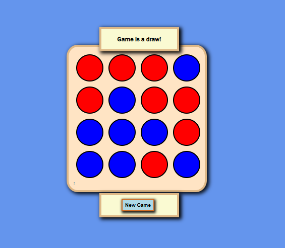

# Connect 4

A simple Connect 4 game built with React.js

## Getting Started

1. Clone the repository: `git clone https://github.com/yuliussetyawan/connect-4.git`
2. Install the dependencies: `npm install` or `yarn install`
3. Start the development server: `npm start` or `yarn start`
4. Open [http://localhost:3000](http://localhost:3000) to view the game in the browser.

## Game Rules
- The objective of the game is to connect four of one's own discs of the same color next to each other vertically, horizontally, or diagonally before your opponent.
- Players take turns choosing a colored disc and placing it on any unoccupied space on the board.
- The game ends when one player has four of their colored discs connected, or when the whole board is filled and no one has won.
- A "Suggest" button in the footer can be used to receive a suggestion for the next move when playing against the bot.

## Built With

- [React.js](https://reactjs.org/) - JavaScript library for building user interfaces
- [create-react-app](https://github.com/facebook/create-react-app) - A tool to set up a new React project with zero configuration

## Deployment
- The game is deployed on [Netlify](https://connect-4-react-js.netlify.app/)

## Author

[Yulius Setyawan](https://github.com/yuliussetyawan)

